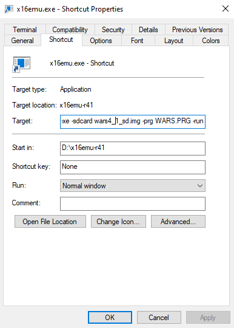

# x16wars

## port of advance wars for gba to the commander x16 

### How to Play

Step 1: Download version R41 of the Commander X16 emulator at https://github.com/commanderx16/x16-emulator/releases

Step 2: Download the SD card image for the latest release [here](https://github.com/cnelson20/x16wars/releases). The file name should be in the format warsX_Y_sd.img

Step 3: Unzip / Extract the downloaded emulator archive, and move the sd card image into that folder

Step 4: Maneuver into the folder that contains the emulator using command prompt, bash, powershell, or any other like application.  
Step 5: run x16emu, ./x16emu .\x16emu.exe (depending on your shell), with flags `-sdcard warsX_Y_sd.img -prg WARS.PRG -run` (replacing warsX_Y with the name of the file you downloaded)

Alternatively on Windows, you can do this instead of steps 4 & 5: 
- Navigate to the emulator directory using File Explorer.
- Right click x16emu.exe, and click "Create Shortcut".
- Right click on the newly created shortcut (it should be called "x16emu.exe - Shortcut") and click Properties
- Make sure you are in the "Shortcut" tab of the properties dialogue, and in the text box labeled "Target" add `-sdcard warsX_Y_sd.img -prg WARS.PRG -run` to the end of the file path, replacing warsX_Y with the version of the SD card image you downloaded.  
It should look like this when you're done:  
  
- If it looks correct you can exit the dialogue by pressing OK, then running the emulator by double clicking the shortcut.

### Controls:
Two options: Keyboard or keyboard joystick or SNES controller

Keyboard:
WASD to move cursor  
I to select units, confirm actions, etc. 
U to deselect units, cancel moves, go back in a prompt.

Keyboard Joystick / Keyboard:
Arrow keys / D-pad to move cursor and navigate menus
A (X / Left Ctrl keys) to select units, confirm actions, etc.  
B (Z / Left Alt keys) to deselect units, cancel moves, go back in a prompt.

### Issues:

missing:
- \>2 player support
- fog of war
- cpu
- CO powers / abilities

bugs:

- entering into the drop prompt can crash the game
