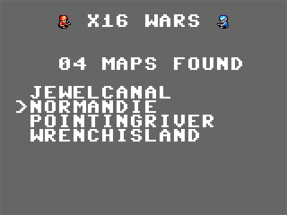

# x16wars

## port of advance wars for gba to the commander x16 

### How to Play

#### Option 1: Web Emulator

You can play online by clicking the Try It Now link at the bottom of the forum page [here](https://cx16forum.com/forum/viewtopic.php?t=6296)

#### Option 2: Local Download

Step 1: Download ve)rsion R41 of the Commander X16 emulator at https://github.com/X16Community/x16-emulator/releases

Step 2: Download the SD card image for the latest release [here](https://github.com/cnelson20/x16wars/releases). The file name should be in the format warsX_Y_sd.img

Step 3: Unzip / Extract the downloaded emulator archive, and move the sd card image into that folder

Step 4: Maneuver into the folder that contains the emulator using command prompt, bash, powershell, or any other like application.  

Step 5: run x16emu, `./x16emu` or `.\x16emu.exe` (depending on your shell/OS), with flags `-sdcard warsX_Y_sd.img -prg WARS.PRG -run` (replacing warsX_Y with the name of the file you downloaded)

### Controls:
Three options: Keyboard,keyboard joystick, or SNES controller

Keyboard:
WASD to move cursor  
I to select units, confirm actions, etc. 
U to deselect units, cancel moves, go back in a prompt.

Keyboard Joystick / Keyboard:
Arrow keys / D-pad to move cursor and navigate menus
A (X / Left Ctrl keys) to select units, confirm actions, etc.  
B (Z / Left Alt keys) to deselect units, cancel moves, go back in a prompt.

### Issues:

missing:
- \>2 player support
- fog of war
- cpu
- CO powers / abilities

bugs:

- entering into the drop prompt can crash the game
